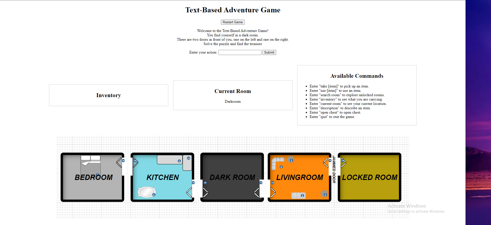

# Text-Based PY Adventure Game

**Description:**

This repository contains a simple text-based adventure game implemented in Python using the Flask web framework. In this game, players navigate through different rooms, solve puzzles, and collect items to progress through the story and find hidden treasures. The game offers an interactive and engaging experience where players can explore various scenarios and make decisions to win.

**Features:**

- Explore different rooms with unique descriptions.
- Collect and manage items in your inventory.
- Solve puzzles and unlock doors.
- Experience an interactive storyline.
- Enjoy a classic text-based adventure game in a web-based format.

This project serves as a fun example of creating text-based games with web interactions using Flask, making it a great starting point for those interested in game development and web programming.

------------------------------------------------------------------------------------------------------------------------------------------------------------------